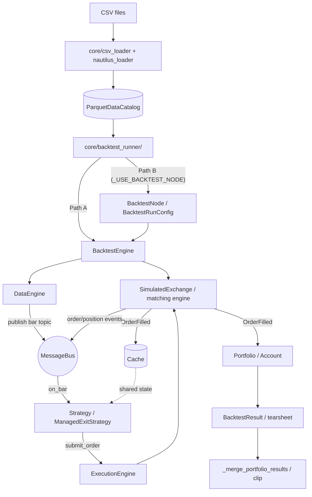

# m-cube — Application Overview & Repository Layout

**m-cube** is a backtesting and research platform for **FX, crypto, and commodities** built on **NautilusTrader**. It's a single Flask web app (Python backend + vanilla HTML/CSS/JS SPA) for loading historical bar data, aggregating it to higher timeframes, running single-strategy and multi-slot portfolio backtests with full exit management (SL / TP / trailing / squareoff / RBO), and viewing tearsheets. A second Flask app under [adapter_admin/](adapter_admin/) administers broker / venue adapter configurations.

For deeper docs see:
- [CLAUDE.md](CLAUDE.md) — architecture cheat-sheet for contributors
- [PORTFOLIO_SETUP_GUIDE.md](PORTFOLIO_SETUP_GUIDE.md) — full design & schema of the portfolio system (most authoritative spec)
- [LOGICS_BACKEND_STATUS.md](LOGICS_BACKEND_STATUS.md) — which UI logics are wired to the backend vs UI-only
- [docs/btsoftware_fx_clone_design.md](docs/btsoftware_fx_clone_design.md) — long-term design target
- [ipynb/README.md](ipynb/README.md) — tour of the aggregation & engine-dispatch verification notebooks
- [how_to_use.txt](how_to_use.txt) — runtime env-var flags

---

## Quick Start

```powershell
# Windows one-shot setup + launch (creates ./venv, installs requirements,
# opens browser at http://localhost:5000)
.\start.bat

# Manual run (venv activated or `pip install -r requirements.txt` already done)
python server.py

# Adapter Admin Panel (separate Flask app on its own port)
python adapter_admin\admin_server.py
```

Python **>= 3.11** required.

---

## Repository Layout

Folders are grouped by role. The two most important things to find your way around are highlighted at the bottom of this section: **where data aggregation happens** and **where aggregation is validated**.

### Backend code

| Folder / file | What it does |
|---|---|
| [server.py](server.py) | Flask REST API. Every endpoint requires an `X-User-Id` header. Routes for data load, view, backtest, portfolio, tearsheet, orderbook, and adapter config. |
| [core/](core/) | All backend business logic — see the file-level breakdown below. |
| [strategies/](strategies/) | Built-in entry strategies (`ema_cross.py`, `rsi_mean_reversion.py`, `bollinger_bands.py`, `four_ma.py`, `range_breakout.py`). Pure signal logic, no exit management. Auto-discovered by [strategies/__init__.py](strategies/__init__.py). |
| [custom_strategies/](custom_strategies/) | User-uploaded strategy `.py` files, organised as `custom_strategies/<user_id>/`. Loaded via [core/custom_strategy_loader.py](core/custom_strategy_loader.py) and merged with built-ins at runtime. |
| [adapter_admin/](adapter_admin/) | Separate Flask app that manages broker / venue adapter configurations. Per-venue JSON in [adapter_admin/adapters_config/](adapter_admin/adapters_config/); custom Python adapters in [adapter_admin/custom_adapters/](adapter_admin/custom_adapters/); data-format specs in [adapter_admin/data_formats/](adapter_admin/data_formats/). |

#### Inside `core/`

`core/` used to be all flat modules. Four of the heaviest ones —
`backtest_runner`, `csv_loader`, `instrument_factory`, and `models` — have since
been **exploded into single-responsibility sub-packages** (see commits
`290856a`, `8fd50c6`, `b0443d0`). Each package owns one logical concern per
sub-directory, with that concern's code living directly in the directory's
`__init__.py`, and re-exports its **full public API** from the package
`__init__.py` — so existing imports such as
`from core.backtest_runner import run_portfolio_backtest`,
`from core.csv_loader import scan_csv_folder`,
`from core.instrument_factory import create_instrument`, and
`from core.models import PortfolioConfig` all continue to work unchanged.

**Flat modules** (the rest of `core/`):

| File | Job |
|---|---|
| [core/managed_strategy.py](core/managed_strategy.py) | **L2 exit-management state machine** — wraps any signal with SL / TP / trailing / squareoff / RBO and exit-action dispatch (`close` / `re_execute` / `reverse`). Also hosts the exploratory `"native_bracket"` exit mode (env `_USE_NATIVE_BRACKET=1`). |
| [core/signals.py](core/signals.py) | `SIGNAL_REGISTRY` — pure signal functions used by `ManagedExitStrategy` to drive entries. |
| [core/strategies.py](core/strategies.py) | Legacy strategy adapters (kept for backwards compatibility). |
| [core/aggregator.py](core/aggregator.py) | **THE data-aggregation engine.** Resamples 1-minute OHLCV → 5/15/30-min, 1/2-hour, 1-day, 1-week, 1-month bars using `closed='right', label='right'` bucketing. Also computes RSI / ATR / EMA / VWAP feature sidecars per aggregated bar. Public entry point: `aggregate_ohlcv(df_1min, timeframe)` and `aggregate_to_timeframes(...)`. |
| [core/aggregating_strategy.py](core/aggregating_strategy.py) | **NEW.** `AggregatingStrategyMixin` — lets a strategy aggregate base bars **in-process** via a `BarAggregator`, as an alternative to Nautilus `INTERNAL@` composite bar types. Passthrough when no aggregation is configured. |
| [core/nautilus_loader.py](core/nautilus_loader.py) | Converts DataFrames into Nautilus `Bar` objects and writes them into the Parquet catalog. |
| [core/venue_config.py](core/venue_config.py) | Reads per-venue JSON from `adapter_admin/adapters_config/` at backtest time. |
| [core/fx_rates.py](core/fx_rates.py) | Cross-currency PnL conversion (e.g. USDJPY → USD account base) using the venue's `fx_conversion` block. |
| [core/tags.py](core/tags.py) | **NEW.** Portfolio **Tag** registry + cross-portfolio PnL aggregation (spec §11). Reads [config/tags.json](config/tags.json) and enforces hierarchical SL / Target caps along the chain **leg → portfolio → TAG → user**. |
| [core/users.py](core/users.py) | Identity-only multi-user layer (no auth); reads [config/users.json](config/users.json). |
| [core/migrate_users.py](core/migrate_users.py) | One-time migration of legacy single-user portfolios into the `_default` bucket. |
| [core/custom_strategy_loader.py](core/custom_strategy_loader.py) | Discovers and imports user-uploaded strategies; merges with built-ins via `get_merged_registry()`. |
| [core/report_generator.py](core/report_generator.py) | Renders backtest results into the HTML tearsheet template. |
| [core/templates.py](core/templates.py) | Shared HTML / report template helpers. |
| [core/runtime_history.py](core/runtime_history.py) | Persists run history to `.runtime_history.json`. |
| [core/_pandas_utils.py](core/_pandas_utils.py) | Internal pandas helpers shared by the loader and aggregator. |

**`core/backtest_runner/` package** — the **L3 portfolio orchestrator**, decomposed by concern. Top-level entry points (`run_backtest`, `run_portfolio_backtest`, `run_backtest_node`) are re-exported from the package, so callers still `from core.backtest_runner import run_portfolio_backtest`.

| Sub-module | Job |
|---|---|
| [core/backtest_runner/orchestration/](core/backtest_runner/orchestration/) | Top-level `run_portfolio_backtest()` — fans slots out to workers, applies portfolio/tag halts, merges results. |
| [core/backtest_runner/single_backtest/](core/backtest_runner/single_backtest/) | `run_backtest()` — the single-strategy (non-portfolio) path. |
| [core/backtest_runner/slot_execution/](core/backtest_runner/slot_execution/) | Per-slot and grouped-slot execution: `_group_slots`, `_run_single_slot`, `_run_slot_group` (the `_USE_GROUPING` shared-engine logic). |
| [core/backtest_runner/path_b/](core/backtest_runner/path_b/) | **Path B** (`_USE_BACKTEST_NODE=1`): builds `BacktestRunConfig`/`BacktestNode`, with filter-support gating and per-slot/group node runners. |
| [core/backtest_runner/bar_filters/](core/backtest_runner/bar_filters/) | Weekday (`run_on_days`), time-of-day (intraday entry window), and after-timestamp bar filtering. |
| [core/backtest_runner/bar_types/](core/backtest_runner/bar_types/) | Bar-type helpers: pair BID/ASK for a MID slot (`_pair_bid_ask_bar_type`), resolve aggregate targets. |
| [core/backtest_runner/data_cache/](core/backtest_runner/data_cache/) | `_cached_catalog_bars` — caches catalog bar reads so grouped slots load bars once. |
| [core/backtest_runner/portfolio_exit_config/](core/backtest_runner/portfolio_exit_config/) | Resolves portfolio-level SL / Target / move-SL-to-cost config (FX vs options-only types, DST handling). |
| [core/backtest_runner/portfolio_clip/](core/backtest_runner/portfolio_clip/) | Portfolio/user **SL-TP halt ("clip")** — finds the earliest point the portfolio or user-level cap is breached and truncates. |
| [core/backtest_runner/cross_portfolio/](core/backtest_runner/cross_portfolio/) | In-process event bus for cross-portfolio / tag-level coordination during a run. |
| [core/backtest_runner/rbo/](core/backtest_runner/rbo/) | Range-Breakout (RBO) settings resolution. |
| [core/backtest_runner/exit_fill/](core/backtest_runner/exit_fill/) | VWAP-based exit fill pricing adjustments. |
| [core/backtest_runner/equity_curves/](core/backtest_runner/equity_curves/) | Builds and merges per-slot equity curves from the account. |
| [core/backtest_runner/results/](core/backtest_runner/results/) | Extracts result dicts: per-strategy breakdown, trade-PnL series. |
| [core/backtest_runner/portfolio_results/](core/backtest_runner/portfolio_results/) | Merges/splices multi-slot results and computes aggregation coordination. |
| [core/backtest_runner/report_utils/](core/backtest_runner/report_utils/) | Positions-report → base-currency PnL conversion + equity-point helpers. |
| [core/backtest_runner/other_settings/](core/backtest_runner/other_settings/) | Misc per-run settings (valid on-SL / on-target action vocab). |
| [core/backtest_runner/profiling/](core/backtest_runner/profiling/) | The `_phase(...)` context manager (zero-cost unless `_PROFILE_PHASES=1`). |

**`core/csv_loader/` package** — CSV ingest, decomposed by layout/responsibility. Fronted by a thin back-compat shim at [core/csv_loader.py](core/csv_loader.py) that re-exports the package API.

| Sub-module | Job |
|---|---|
| [core/csv_loader/csv_reader/](core/csv_loader/csv_reader/) | Loads a single CSV with PyArrow (~35× faster than pandas), case-insensitive column mapping, validation → clean OHLCV DataFrame. |
| [core/csv_loader/folder_scanner/](core/csv_loader/folder_scanner/) | Orchestrates all layout scanners in fallback order (consolidated FX → flat crypto → FX daily → commodity daily → index daily → nested crypto); returns the first non-empty result. |
| [core/csv_loader/fx_consolidated_scanner/](core/csv_loader/fx_consolidated_scanner/) | Discovers one-file-per-side consolidated FX CSVs (`{PAIR}_{PAIR}_…_{ASK\|BID\|MID}_OHLCV.csv`). |
| [core/csv_loader/fx_daily_scanner/](core/csv_loader/fx_daily_scanner/) | Aggregates daily FX CSVs at `<PAIR>/YYYY/MM/DD/…(BID\|ASK)…` into ASK/BID/MID entries per pair. |
| [core/csv_loader/crypto_nested_scanner/](core/csv_loader/crypto_nested_scanner/) | Scans nested crypto layout `<BASE-QUOTE>/YYYY/MM/<daily>.csv` with the venue taken from the root folder. |
| [core/csv_loader/commodity_daily_scanner/](core/csv_loader/commodity_daily_scanner/) | Scans daily commodity CSVs `<COMMODITY>/YYYY/MM/DD/(ASK\|BID).csv` → ASK/BID/MID. |
| [core/csv_loader/index_daily_scanner/](core/csv_loader/index_daily_scanner/) | Scans single-stream daily index layout (no ASK/BID split); derives symbol from the root folder. |
| [core/csv_loader/mid_merge/](core/csv_loader/mid_merge/) | Synthesizes MID OHLCV from ASK + BID (O/H/L/C averaged, volume summed). |
| [core/csv_loader/side_concat/](core/csv_loader/side_concat/) | Concatenates one side's daily CSVs in parallel (ThreadPoolExecutor), drops midnight duplicates. |
| [core/csv_loader/timestamp_parser/](core/csv_loader/timestamp_parser/) | Parses timestamps to UTC; PyArrow vectorized fast-path (~22×) with pandas fallback. |
| [core/csv_loader/scan_cache/](core/csv_loader/scan_cache/) | Module-level mtime+TTL scan caches; `clear_fx_scan_cache()` drops them. |
| [core/csv_loader/constants/](core/csv_loader/constants/) | Shared constants: `DEFAULT_CSV_FOLDER`, `QUANTITY_MAX`, symbol normalisation, filename regexes. |

**`core/instrument_factory/` package** — dynamic Nautilus `CurrencyPair` construction. (The old flat `core/instrument_factory.py` was removed; the API lives in the package.)

| Sub-module | Job |
|---|---|
| [core/instrument_factory/instrument_builder/](core/instrument_factory/instrument_builder/) | Assembles the final `CurrencyPair`; the `create_instrument()` entry point. |
| [core/instrument_factory/bar_type_resolver/](core/instrument_factory/bar_type_resolver/) | Resolves a bar type → instrument **catalog-first**, falling back to asset-class precision when not yet ingested. |
| [core/instrument_factory/catalog_lookup/](core/instrument_factory/catalog_lookup/) | Authoritative instrument lookup from the `ParquetDataCatalog` (so precision validation matches what the engine loads). |
| [core/instrument_factory/currency/](core/instrument_factory/currency/) | Builds Nautilus `Currency` objects (fiat precision overrides; crypto defaults to precision 8). |
| [core/instrument_factory/data_format_config/](core/instrument_factory/data_format_config/) | Reads per-asset-class `instrument` config from `adapter_admin/data_formats/<asset_class>.json`. |
| [core/instrument_factory/lot_size/](core/instrument_factory/lot_size/) | Resolves per-symbol lot size + trade-size cap from `adapter_admin/adapters_config/<venue>.json`. |
| [core/instrument_factory/price_size_precision/](core/instrument_factory/price_size_precision/) | Built-in precision tables (`PRICE_PRECISION`, `BASE_PRICE_PRECISION`) and override resolvers. |

**`core/models/` package** — portfolio schema dataclasses + helpers. (The old flat `core/models.py` was removed; the API lives in the package.)

| Sub-module | Job |
|---|---|
| [core/models/portfolio_config/](core/models/portfolio_config/) | Outermost dataclass: capital, loss/profit caps, allocation mode, date range, square-off (MIS/NRML), day-of-week filters, tag, RBO, and the nested slots. |
| [core/models/strategy_slot_config/](core/models/strategy_slot_config/) | Per-slot dataclass: strategy + bar type + sizing (lots/allocation) with an embedded `ExitConfig`, plus per-slot date range / square-off overrides. |
| [core/models/exit_config/](core/models/exit_config/) | Leaf dataclass: all leg-level exit management (SL/TP type+value, ATR sizing, trailing, target-lock, on-SL/Target actions, leg square-off). |
| [core/models/composite_bar_type/](core/models/composite_bar_type/) | Builds Nautilus composite bar types (`INTERNAL@EXTERNAL`) and validates/repairs strategy-subscribe timeframes against the data feed. |
| [core/models/leg_actions/](core/models/leg_actions/) | Canonical leg-exit action vocabulary (`close`, `re_execute`, `reverse`, …) + comma-combo parsing/validation. |
| [core/models/slot_sizing/](core/models/slot_sizing/) | `effective_slot_qty()` — materializes four sizing tiers (admin lot_size, admin trade_size cap, user lots, user multiplier) into the final order quantity. |
| [core/models/squareoff/](core/models/squareoff/) | Square-off time helpers; `resolve_squareoff()` applies the **leg > slot > portfolio** priority. |
| [core/models/timeframe_utils/](core/models/timeframe_utils/) | Low-level bar-type timeframe parsing (`"1-MINUTE"` → 60s, extract `"30-MINUTE"` from a bar-type string). |
| [core/models/serialization/](core/models/serialization/) | `PortfolioConfig` ↔ dict, unknown-field filtering, and `_migrate_legacy_trade_size` (`trade_size` → `lots`). |
| [core/models/persistence/](core/models/persistence/) | Save / load / list / delete portfolio JSON under `portfolios/`; stamps `updated_at`. |

#### What's new / recent advancements

Highlights of recent work, beyond the original single-file backend:

- **`core/` modularization** — `csv_loader`, `instrument_factory`, and `models`
  are now sub-packages of single-responsibility modules (tables above), with
  back-compat re-exports.
- **Portfolio Tags** — [core/tags.py](core/tags.py) + [config/tags.json](config/tags.json)
  group portfolios under a tag for **cross-portfolio PnL aggregation** and a new
  cap tier in the **leg → portfolio → TAG → user** SL/Target hierarchy.
- **In-process aggregation** — [core/aggregating_strategy.py](core/aggregating_strategy.py)
  (`AggregatingStrategyMixin`) aggregates base bars inside the strategy, an
  alternative to Nautilus `INTERNAL@` composite bars.
- **Native bracket orders (exploratory)** — env `_USE_NATIVE_BRACKET=1` switches
  plain fixed-SL/fixed-TP legs to a NautilusTrader **bracket** submitted at entry,
  letting the matching engine fire SL/TP at the trigger/limit instead of m-cube
  closing with market orders. See [core/managed_strategy.py](core/managed_strategy.py).
- **Multi-asset-class ingest** — dedicated CSV scanners for FX (consolidated +
  daily), crypto (nested), commodities (daily), and **indices** (daily), all under
  [core/csv_loader/](core/csv_loader/).
- **Auto HTML reports** — a CI workflow renders backtest reports into
  [html_reports/](html_reports/) on push (companion to the `html-report-generator`
  Claude skill).

### Data — input → catalog → output

| Folder | What it stores |
|---|---|
| [csv/](csv/) | **Raw input data**. Subfolders `fx_csv/` (1-min ASK / BID CSV exports per pair) and `commodities_csv/` (commodity 1-min bars). This is what gets ingested into the catalog. |
| [catalog/](catalog/) | NautilusTrader `ParquetDataCatalog` — the single source of truth that `server.py` and the runner read from. Aggregated parquets live at `catalog/data/bar/<bar_type>/`; **every higher-timeframe bar (5m, 15m, 30m, 1h, 2h, 1d, 1w, 1mo) produced by the aggregator ends up here**. Instrument definitions live at `catalog/data/currency_pair/`; feature sidecars at `catalog/features/bar/`. |
| [data/](data/) | Debug snapshots from sniffer / engine-dispatch runs (raw 1-min CSVs, `order_events/`). Not used by production code paths. |
| [temp_csv/](temp_csv/) | Short-lived per-run output: `fills.csv`, `positions.csv`, `account.csv`, `summary.csv` written by smoke scripts such as [scripts/run_ema_cross_april2024.py](scripts/run_ema_cross_april2024.py). |

### Aggregation validation

| Folder / file | What it validates |
|---|---|
| [ipynb/](ipynb/) | Notebooks that **verify the aggregation pipeline** and demonstrate Nautilus's two-layer data model (`DataEngine` → strategy vs `SimulatedExchange` → matching). Start with [ipynb/README.md](ipynb/README.md) for the full methodology. |
| [ipynb/individual_timeframes_validation_scripts/](ipynb/individual_timeframes_validation_scripts/) | **Per-timeframe aggregation validation.** Each notebook compares three independent OHLCV paths within `1e-8` price / `1e-6` volume tolerance: (a) `core/aggregator.py` output, (b) an independent `pandas.resample()` reference, and (c) the stored catalog parquet. |
| [ipynb/individual_timeframes_validation_scripts/fx_validation/](ipynb/individual_timeframes_validation_scripts/fx_validation/) | FX universe (EURUSD / GBPUSD / USDJPY × BID / ASK). Validates 1-min → 15-min, 30-min, 1-hour, 2-hour, 1-week, 1-month. Plus [aggregate_1min_to_5min.ipynb](ipynb/individual_timeframes_validation_scripts/fx_validation/aggregate_1min_to_5min.ipynb) (5-min aggregation pass) and [check_missing_minutes_eurusd_ask.ipynb](ipynb/individual_timeframes_validation_scripts/fx_validation/check_missing_minutes_eurusd_ask.ipynb) (input-side gap audit). |
| [ipynb/individual_timeframes_validation_scripts/commodities_validation/](ipynb/individual_timeframes_validation_scripts/commodities_validation/) | Commodities universe — all 8 target timeframes: 5-min, 15-min, 30-min, 1-hour, 2-hour, 1-day, 1-week, 1-month. |
| [ipynb/catalog_aggregation_verification.ipynb](ipynb/catalog_aggregation_verification.ipynb) | Catalog-wide sweep: verifies all 48 `(instrument, side, timeframe)` parquets at once and writes per-bar window metadata to `reports/catalog_aggregation_windows.csv.gz`. |
| [ipynb/aggregator_strategy_demo.ipynb](ipynb/aggregator_strategy_demo.ipynb) | Compares a hand-written 5-min aggregator against Nautilus's internal `TimeBarAggregator` running the same EMA-cross strategy. |
| [ipynb/oms_granularity_simulation.ipynb](ipynb/oms_granularity_simulation.ipynb), [ipynb/engine_dispatch_verification.ipynb](ipynb/engine_dispatch_verification.ipynb) | Empirical proofs that the strategy can see 5-min bars while the matching engine fills against 1-min bars (two-layer dispatch). |
| [ipynb/run_ema_cross_april2024.ipynb](ipynb/run_ema_cross_april2024.ipynb) | Notebook companion to [scripts/run_ema_cross_april2024.py](scripts/run_ema_cross_april2024.py). |
| [tests/test_aggregator.py](tests/test_aggregator.py) | Unit-level counterpart to the validation notebooks — pytest invariants on bucketing math, volume clipping, and feature parity. |

### Frontend

| Folder / file | What it does |
|---|---|
| [static/](static/) | Vanilla HTML / CSS / JS SPA. |
| [static/index.html](static/index.html) | App shell with early-paint theme script. |
| [static/css/style.css](static/css/style.css) | Styles + `data-theme` light/dark variables. |
| [static/js/app.js](static/js/app.js) | SPA router and per-user gating. |
| [static/js/dashboard.js](static/js/dashboard.js), [static/js/load_data.js](static/js/load_data.js), [static/js/view_data.js](static/js/view_data.js), [static/js/backtest.js](static/js/backtest.js), [static/js/tearsheet.js](static/js/tearsheet.js), [static/js/orderbook.js](static/js/orderbook.js), [static/js/portfolio.js](static/js/portfolio.js), [static/js/portfolio_tearsheet.js](static/js/portfolio_tearsheet.js) | Page modules — each is a named export from `app.js`'s router. |

### Configuration & saved state

| Folder | What it holds |
|---|---|
| [config/](config/) | `users.json` (identity registry for the `X-User-Id` header) and `portfolio_tabs/` (declarative UI tab definitions for the portfolio editor). |
| [portfolios/](portfolios/) | Saved portfolio JSON, organised as `portfolios/<user_id>/<name>.json`. The reserved `_default/` bucket holds legacy pre-multi-user portfolios. |

### Scripts & CLIs

[scripts/](scripts/) — standalone command-line entry points.

| Script | Purpose |
|---|---|
| [scripts/aggregate_catalog.py](scripts/aggregate_catalog.py) | **CLI entry point to the aggregation pipeline.** Reads 1-min parquets from the catalog and writes higher timeframes back, using `core/aggregator.py`. |
| [scripts/load_commodities.py](scripts/load_commodities.py) | Bulk-ingests commodity CSVs into the catalog and auto-aggregates post-load. |
| [scripts/ingest_fx_bulk.py](scripts/ingest_fx_bulk.py) | Bulk-ingests FX CSVs into the catalog. |
| [scripts/run_ema_cross_april2024.py](scripts/run_ema_cross_april2024.py) | Smallest reproducible smoke run of the production stack (EMA Cross + `ManagedExitStrategy` over EURUSD April-2024). Writes `temp_csv/{fills,positions,account,summary}.csv`. |
| [scripts/run_yearly_eurusd_emaxma.py](scripts/run_yearly_eurusd_emaxma.py) | Year-long EMA crossover run for benchmarking. |
| [scripts/verify_grouping_parity.py](scripts/verify_grouping_parity.py) | Proves `_USE_GROUPING=1` produces identical P&L to per-slot for a given portfolio. |
| [scripts/benchmark_portfolio.py](scripts/benchmark_portfolio.py), [scripts/profile_slot.py](scripts/profile_slot.py), [scripts/aggregate_phase_profiles.py](scripts/aggregate_phase_profiles.py) | Performance benchmarking / phase profiling. |
| [scripts/capture_order_events.py](scripts/capture_order_events.py) | Captures engine order-event logs for debugging. |
| [scripts/render_report_html.py](scripts/render_report_html.py) | Renders a saved backtest result as a standalone HTML report. |

### Tests

| Folder / file | What it covers |
|---|---|
| [tests/test_aggregator.py](tests/test_aggregator.py) | Aggregator bucketing, volume clipping, feature parity (unit-level companion to the validation notebooks). |
| [tests/test_custom_strategy_loader.py](tests/test_custom_strategy_loader.py) | Custom-strategy discovery & registry merging. |
| [tests/test_perf_regression.py](tests/test_perf_regression.py) | Performance regression baselines. |
| [tests/smoke_tests/](tests/smoke_tests/) | Portfolio smoke + stress tests (`smoke_test_logics_audit.py`, `stress_test_portfolios.py`, `stress_test_stoploss.py` and matching `*_report.py` companions that render results as HTML). |
| [verify_session_changes.py](verify_session_changes.py) | Hand-rolled 100+-check wiring verifier (not pytest; keep green). |

### Reports & outputs

| Folder | What it holds |
|---|---|
| [reports/](reports/) | Long-lived analysis artefacts, including `catalog_aggregation_windows.csv.gz` (~64 MB; one row per aggregated bar — the receipt for [ipynb/catalog_aggregation_verification.ipynb](ipynb/catalog_aggregation_verification.ipynb)). |
| [reports_aggregator_demo/](reports_aggregator_demo/) | Per-run CSVs from [ipynb/aggregator_strategy_demo.ipynb](ipynb/aggregator_strategy_demo.ipynb) (internal vs custom aggregator comparison). |
| [html_reports/](html_reports/) | Rendered HTML user guides on aggregation, SL/TP logic, storage patterns. |
| [output/](output/) | Debug dumps (missing-minute scans, sniffer outputs, ad-hoc analysis CSVs). |

### Documentation

| Folder / file | Contents |
|---|---|
| [docs/](docs/) | HTML user guides and the BTSoftware FX-clone design target. |
| [5. Logics/](5.%20Logics/) | HTML business-logic specs (execution, exit-settings, re-execution, hedge, stop-loss/target, RBO). Subfolders archive stress-test / stoploss-test results. |
| [README.md](README.md) | Top-level project pointer (unchanged short overview). |
| [CLAUDE.md](CLAUDE.md), [PORTFOLIO_SETUP_GUIDE.md](PORTFOLIO_SETUP_GUIDE.md), [LOGICS_BACKEND_STATUS.md](LOGICS_BACKEND_STATUS.md), [how_to_use.txt](how_to_use.txt) | Authoritative specs and runtime-flag reference. |

### Build / misc

| File | Purpose |
|---|---|
| [requirements.txt](requirements.txt) | Pinned Python dependencies (`nautilus_trader==1.224.0`, `Flask==3.1.3`, `pandas==2.3.3`, `numpy==2.4.3`, `pyarrow==23.0.1`). |
| [Dockerfile](Dockerfile), [.dockerignore](.dockerignore) | Container build. |
| [start.bat](start.bat) | Windows one-shot setup + launch. |
| [how_to_use.txt](how_to_use.txt) | Runtime env-var flags (`_USE_GROUPING`, `_USE_BACKTEST_NODE`, `_PROFILE_PHASES`, `_USE_NATIVE_BRACKET`). |

---

## NautilusTrader Functionalities (the backtest data flow)

m-cube is built on **NautilusTrader 1.224.0**. A backtest is a pipeline of
NautilusTrader components; this section describes each one and how m-cube uses
it. (Descriptions are grounded in the installed package source under
`venv/Lib/site-packages/nautilus_trader/`, accurate to 1.224.0.)

1. **`ParquetDataCatalog`** — the on-disk source of truth. Bars and instruments
   are stored as Parquet under `data/bar/<bar_type>/` and `data/currency_pair/`;
   `write_data(...)` persists, `bars(...)` / `instruments(...)` read them back as
   typed Nautilus objects. This is m-cube's [catalog/](catalog/).
2. **`BacktestEngine`** — the lower-level engine wired up imperatively:
   `add_venue(...)` (creates a `SimulatedExchange` with an OMS type, account, and
   balances), `add_instrument(...)`, `add_data(...)`, `add_strategy(...)`, then
   `run()`. It owns a kernel holding the clock, `Cache`, `MessageBus`,
   `DataEngine`, and `ExecutionEngine`. This is m-cube **Path A** in
   [core/backtest_runner/](core/backtest_runner/).
3. **`BacktestNode` / `BacktestRunConfig`** — the higher-level declarative path.
   `BacktestRunConfig` bundles venue + data (pointing at a catalog) + strategy
   configs; `BacktestNode([...]).run()` builds an engine per config and returns
   `BacktestResult`s. This is m-cube **Path B** (`_USE_BACKTEST_NODE=1`); it
   auto-falls-back to Path A when bar-filtering features are active.
4. **`DataEngine`** — routes data. The backtest loop calls
   `DataEngine.process(data)`, which **publishes** each item onto the
   `MessageBus` on a typed topic (e.g. the bars topic for a `BarType`).
   Subscribed strategies/actors receive it. It does **not** feed the exchange —
   that is a separate step.
5. **`SimulatedExchange` / matching engine** — one per venue. Each bar/tick is
   fed to the exchange, which **fills resting orders against bar OHLC**. The OMS
   type set at `add_venue` decides position behaviour: **NETTING** nets into one
   position per instrument; **HEDGING** assigns a new position ID per order so
   long+short can coexist. Account type, starting balances, leverage, and
   fee/latency models are configured here.
6. **`Strategy`** (`nautilus_trader.trading.strategy.Strategy`) — user signal +
   order logic. Lifecycle: `on_start` (subscribe to bars) → `on_bar` (fired when
   the bus delivers a subscribed bar) → `submit_order(...)` (routes through the
   `ExecutionEngine` to the exchange), plus `on_order_*` / `on_position_*` and
   `on_stop`. m-cube's L1 strategies and the L2
   [`ManagedExitStrategy`](core/managed_strategy.py) are subclasses.
7. **`Bar` / `BarType`** — a `Bar` is OHLCV + `ts_event`/`ts_init`. The `BarType`
   string is `<symbol>.<venue>-<step>-<aggregation>-<price_type>-<source>`, e.g.
   `USDJPY.FOREX_MS-1-MINUTE-MID-EXTERNAL`. `EXTERNAL` = pre-aggregated (loaded);
   `INTERNAL` = aggregated live during the run.
8. **`Instrument` / `CurrencyPair`** — defines the tradable contract: price/size
   precision, tick size, lot size, margins, and currencies. Must be added via
   `add_instrument` and matched by `InstrumentId` venue. m-cube builds these in
   [core/instrument_factory/](core/instrument_factory/).
9. **`Cache`** — in-memory store of domain state: instruments, orders, positions,
   accounts, and recent bars/ticks. Strategies query it (e.g.
   `self.cache.position(...)`); the exchange and engine read/write it during the run.
10. **`MessageBus`** — the pub/sub + request/reply backbone. The `DataEngine`
    publishes data to topics that strategies subscribe to; order commands and
    order/position events also flow over it between strategy, `ExecutionEngine`,
    and exchange.
11. **`Portfolio` / `Account`** — the `Account` (per venue) tracks balances and
    margin, updated by fills; the `Portfolio` aggregates positions and computes
    realized/unrealized PnL and net exposure. These are the source of the final
    result metrics that feed m-cube's tearsheets.
12. **Order types & `Position`** — `MarketOrder`, `LimitOrder`, `StopMarketOrder`,
    etc. A **bracket** is an OTO/OCO contingent group (entry + SL + TP) built via
    `order_factory.bracket(...)` — this is what the `_USE_NATIVE_BRACKET` mode
    submits. A `Position` is opened/updated/closed by `OrderFilled` events and
    carries its own PnL.
13. **`TimeBarAggregator`** — builds `INTERNAL`-source time bars from incoming
    ticks/quotes during the run. **Bypassed** in m-cube's FX path: MID bars are
    `EXTERNAL`, synthesized at CSV-load time (see [core/csv_loader/](core/csv_loader/)),
    so they are never re-aggregated by the engine.

### No-lookahead ordering

Within a single engine iteration the order is **exchange-fill → publish data to
strategy → settle**. So a bar fills already-resting orders **before** the
strategy's `on_bar` sees that same bar; an order the strategy submits inside
`on_bar` is matched against a **subsequent** bar — never retroactively against
the bar that triggered it. This is the key no-lookahead correctness guarantee.

### Data-flow dependency graph



*Per time-ordered data item the exchange fills resting orders first, then the bar
is published to the strategy, then venue messages settle. Path B builds the same
`BacktestEngine` under the hood and falls back to Path A when bar-filtering
features (`run_on_days`, intraday entry windows) are active.*

---

## The Aggregation Pipeline — Where & How

**Aggregation happens in [core/aggregator.py](core/aggregator.py).** Public entry points: `aggregate_ohlcv(df_1min, timeframe)` for a single timeframe and `aggregate_to_timeframes(...)` for the full fan-out. Bucketing uses `closed='right', label='right'`: the bar stamped at `T` aggregates the 1-min bars in the half-open window `(T − N, T]`. Volume is summed and clipped to `QUANTITY_MAX`. RSI / ATR / EMA / VWAP feature sidecars are computed post-aggregation.

It is invoked from three places:
- The `/api/csv/load` endpoint in [server.py](server.py) when fresh CSVs are ingested via the UI.
- The CLI [scripts/aggregate_catalog.py](scripts/aggregate_catalog.py) — reads 1-min parquets from the catalog and writes higher timeframes back.
- The CLI [scripts/load_commodities.py](scripts/load_commodities.py) — bulk-loads commodity CSVs and auto-aggregates as a post-step.

Output is written to [catalog/](catalog/) as Parquet at `catalog/data/bar/<bar_type>/`, one folder per `(instrument, side, timeframe)` tuple.

**Validation of aggregation lives in [ipynb/individual_timeframes_validation_scripts/](ipynb/individual_timeframes_validation_scripts/).** Two parallel folders cover the two asset universes:
- [fx_validation/](ipynb/individual_timeframes_validation_scripts/fx_validation/) — one notebook per target timeframe for EURUSD / GBPUSD / USDJPY (BID + ASK).
- [commodities_validation/](ipynb/individual_timeframes_validation_scripts/commodities_validation/) — one notebook per target timeframe for the commodity universe.

Each notebook enforces a **three-way invariant**: `core.aggregator.aggregate_ohlcv(...)` ≡ independent `pandas.resample(...)` reference ≡ stored catalog parquet, within `1e-8` price / `1e-6` volume tolerance. The catalog-wide sweep over all 48 `(instrument, side, timeframe)` tuples is [ipynb/catalog_aggregation_verification.ipynb](ipynb/catalog_aggregation_verification.ipynb). The unit-level counterpart is [tests/test_aggregator.py](tests/test_aggregator.py). Full methodology: [ipynb/README.md](ipynb/README.md).

---

## How to Use the App

1. **Load Data.** Point the loader at your CSV folder. Use presets (BTC / ETH / SOL / EURUSD / …) or pick symbols manually. Click "Load Selected" — the file is parsed by [core/csv_loader.py](core/csv_loader.py), the 1-minute bars are written to the catalog, and [core/aggregator.py](core/aggregator.py) fans out the higher timeframes.
2. **View Data.** Pick a loaded symbol; the UI shows candlestick charts, OHLCV tables, daily return distribution, and cumulative returns.
3. **Run Backtest.** Pick a symbol, a strategy (EMA Cross / RSI Mean Reversion / Bollinger Bands / Four MA / Range Breakout, or a custom `.py` upload), tweak its parameters, click "Run Backtest".
4. **Build a Portfolio.** Open the portfolio editor; add slots (each is a strategy + instrument + bar type + exit config), set portfolio-level capital / squareoff / SL/TP, save, then run. Multi-slot runs dispatch through [core/backtest_runner/](core/backtest_runner/).
5. **Tearsheet.** Equity curve, drawdown, win / loss distribution, trade-by-trade P&L.

---

## Further Reading

- [CLAUDE.md](CLAUDE.md) — backend layer cheat-sheet (L0–L4), Path A / Path B / grouping flags, FX-specific concerns, repo conventions.
- [PORTFOLIO_SETUP_GUIDE.md](PORTFOLIO_SETUP_GUIDE.md) — definitive schema and end-to-end design of the portfolio system.
- [LOGICS_BACKEND_STATUS.md](LOGICS_BACKEND_STATUS.md) — UI tab → backend wiring status table.
- [docs/btsoftware_fx_clone_design.md](docs/btsoftware_fx_clone_design.md) — long-term design target.
- [ipynb/README.md](ipynb/README.md) — full tour of the verification notebooks.
- [how_to_use.txt](how_to_use.txt) — runtime env-var flags.
